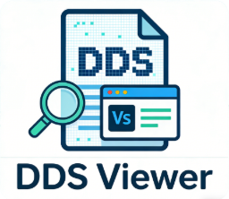

## 🇨🇳 中文版本
# DDS Viewer - VSCode扩展

一个为Mod开发者设计的DDS图像预览工具，帮助您快速查看和评估纹理尺寸，为选择合适的图形格式提供参考。

  

  <a href="#中文">中文</a> | 
  <a href="#english">English</a>

## 📋 使用前说明

> **致歉与说明**：本工具主要面向**中小型Mod开发场景**，旨在提供便捷的实时预览功能。
> - 对于小型Mod或快速原型，建议使用PNG格式（体积小、兼容性好）
> - 对于大型Mod或需要批量处理的情况，请使用专业的批量转换工具（本扩展专注于单文件预览）

## ⚙️ 运行示例

  
  
   
  
  

## ✨ 核心价值

### 🎯 Mod开发友好特性
- **实时尺寸对比**：快速查看DDS纹理尺寸，帮助判断是否可以用PNG平替
- **快速格式评估**：分析不同压缩格式的体积差异，为格式选择提供依据
- **轻量级工具**：专注于预览和快速评估，不集成复杂的批量处理功能

### 🔍 查看功能
- **尺寸一目了然**：直接显示纹理的宽高信息
- **格式智能识别**：自动检测DDS压缩格式并显示技术细节

### 📊 快速评估指标
- **文件大小对比**：显示实际文件大小，评估存储成本
- **技术参数展示**：Mipmap数量、压缩类型等关键信息
- **格式兼容性**：标记当前格式的兼容性状况

## 🧠 DDS格式基础知识

### 为什么游戏使用DDS？
DDS（DirectDraw Surface）是DirectX的标准纹理格式，主要优势：

| 格式类型 | 特点 | 适用场景 |
|---------|------|----------|
| **DXT1 (BC1)** | 4:1压缩比，适合无/简单透明度 | 漫反射贴图、简单纹理 |
| **DXT3 (BC2)** | 带4位Alpha通道，适合锐利边缘 | UI元素、带透明边缘的纹理 |
| **DXT5 (BC3)** | 带插值Alpha通道，适合渐变透明 | 粒子效果、渐变透明纹理 |
| **BGRA/BGR** | 未压缩格式，质量无损但体积大 | 高保真纹理、参考图像 |
| **BC4/BC5** | 单/双通道压缩，适合法线/高度图 | 法线贴图、高度图 |

### 小型Mod开发建议
对于大多数中小型Mod，建议优先考虑：
1. **PNG格式**：体积小、兼容性好、易编辑
2. **DXT1/DXT5**：当需要压缩且游戏引擎支持时使用
3. **避免DX10+**：除非目标游戏明确要求

## 🚀 快速使用指南

### 安装扩展
1. VSCode扩展市场搜索"DDS Viewer"
2. 点击安装
3. 重启VSCode即可使用
4. 现在你的dds文件就可以交给它啦！

### 使用场景
1. **评估纹理尺寸**：打开DDS文件，快速查看宽高和体积
2. **格式转换参考**：根据显示的压缩信息，决定是否转换为PNG
3. **技术参数查阅**：查看Mipmap数量、压缩类型等详细信息

### 操作方法
1. **直接双击**：在资源管理器双击.dds文件
2. **右键菜单**：右键选择"Open with DDS Preview"
3. **命令面板**：Ctrl+Shift+P输入"DDS: Preview File"

## 📈 格式支持状态

| 格式 | 压缩比 | 游戏兼容性 | 小型Mod建议 |
|------|--------|------------|-------------|
| **DXT1** | 6:1 | ⭐⭐⭐⭐⭐ | 推荐（如需压缩） |
| **DXT3** | 4:1 | ⭐⭐⭐⭐ | 较少使用 |
| **DXT5** | 4:1 | ⭐⭐⭐⭐⭐ | 推荐（如需Alpha） |
| **BGRA** | 1:1 | ⭐⭐⭐⭐⭐ | PNG更优 |
| **BGR** | 1:1 | ⭐⭐⭐⭐ | PNG更优 |
| **DX10+** | 可变 | ⭐⭐ | 大型Mod专用 |

## 💡 Mod开发建议

### 使用PNG的情况
✅ **推荐使用PNG**：
- 纹理尺寸 ≤ 512×512
- 文件总数 < 50个
- 需要频繁编辑和修改
- 跨游戏/引擎兼容性要求高

### 使用DDS的情况
✅ **考虑使用DDS**：
- 纹理尺寸 ≥ 1024×1024
- 游戏引擎强制要求DDS格式
- 需要Mipmap自动生成
- 内存占用是首要考虑因素

### 工具选择建议
- **本扩展**：适合单文件预览和快速评估
- **批量工具**：如TexConv、NVIDIA Texture Tools等
- **编辑器插件**：如Photoshop DDS插件

## 🔧 技术说明

### 工作原理
1. **格式检测**：解析DDS文件头，识别压缩格式
2. **实时解码**：使用JavaScript实现DXT1/3/5解码算法
3. **尺寸评估**：计算并显示纹理的实际像素尺寸
4. **格式建议**：基于尺寸和格式提供替代建议

### 性能特点
- **轻量级**：单文件处理，内存占用低
- **快速预览**：解码和显示在毫秒级完成
- **零配置**：开箱即用，无需额外设置

## 🤝 贡献与反馈

如果您是Mod开发者，欢迎：
1. **分享使用经验**：不同游戏引擎的最佳实践
2. **反馈实际需求**：告诉我们您最需要的功能
3. **建议改进方向**：如何让工具更贴合Mod开发流程

---

> **最后提醒**：本工具旨在提供**快速评估参考**，实际格式选择请综合考虑游戏引擎要求、性能需求和开发便利性。小型Mod请优先考虑PNG格式的便利性，大型项目请使用专业的批量处理工具。

---
## 🇬🇧 English Version
# DDS Viewer – Visual Studio Code Extension

A DDS image preview tool designed for mod developers, enabling rapid texture inspection and format evaluation to support informed graphics format selection.

  

  <a href="#中文">中文</a> | 
  <a href="#english">English</a>

## 📋 Prerequisites

> **Note**: This tool is optimized for **small to medium mod development workflows**, focusing on real-time preview capabilities.  
> - For small mods or prototyping, PNG is recommended for its balance of size and compatibility.
> - For large-scale mods or batch processing, please use dedicated batch conversion tools.

## ⚙️ Getting Started

  
  
   
  
  

## ✨ Core Features

### 🎯 Mod-Oriented Design
- **Real-time size comparison**: Quickly assess texture dimensions to evaluate PNG suitability.
- **Format evaluation**: Analyze volume differences across compression formats.
- **Lightweight tooling**: Focused on preview and assessment without complex batch processing.

### 🔍 Inspection Capabilities
- **Dimension display**: Immediate width and height visualization.
- **Format detection**: Automatic identification of DDS compression type with technical details.

### 📊 Assessment Metrics
- **File size comparison**: Display actual file size for storage impact analysis.
- **Technical parameters**: Mipmap counts, compression type, and other key metadata.
- **Compatibility indicators**: Flag format compatibility for common game engines.

## 🧠 DDS Format Overview

### Why Games Use DDS?
DDS (DirectDraw Surface) is the standard texture format for DirectX, offering the following advantages:

| Format       | Characteristics                     | Typical Use Case                |
|--------------|-------------------------------------|----------------------------------|
| **DXT1 (BC1)** | 4:1 compression, no/alpha simple   | Diffuse maps, simple textures   |
| **DXT3 (BC2)** | 4-bit alpha, sharp edges           | UI elements, masked textures    |
| **DXT5 (BC3)** | Interpolated alpha, smooth transparency | Particles, gradient alpha     |
| **BGRA/BGR**  | Uncompressed, lossless quality     | High-fidelity textures, reference images |
| **BC4/BC5**   | Single/dual channel compression    | Normal maps, height maps        |

### Recommendations for Small Mods
For most small to medium mods, consider:
1. **PNG format**: Small size, broad compatibility, easy editing.
2. **DXT1/DXT5**: When compression is needed and supported by the engine.
3. **Avoid DX10+**: Unless explicitly required by the target game.

## 🚀 Quick Start

### Installation
1. Search for "DDS Viewer" in the VSCode Extensions Marketplace.
2. Click Install.
3. Restart VSCode.
4. The extension is ready to handle your `.dds` files.

### Use Cases
1. **Texture dimension assessment**: Open a DDS file to view its size and volume.
2. **Format conversion reference**: Decide whether to convert to PNG based on compression info.
3. **Technical inspection**: Review mipmap counts, compression type, and other details.

### Interaction
1. **Double-click**: Open a `.dds` file directly in the Explorer.
2. **Context menu**: Right-click and select "Open with DDS Preview".
3. **Command palette**: Press `Ctrl+Shift+P` and type "DDS: Preview File".

## 📈 Format Support Summary

| Format  | Compression | Game Compatibility | Small Mod Recommendation   |
|---------|-------------|---------------------|----------------------------|
| **DXT1**  | 6:1         | ⭐⭐⭐⭐⭐             | Recommended (if compression needed) |
| **DXT3**  | 4:1         | ⭐⭐⭐⭐              | Less common                |
| **DXT5**  | 4:1         | ⭐⭐⭐⭐⭐             | Recommended (if alpha needed) |
| **BGRA**  | 1:1         | ⭐⭐⭐⭐⭐             | PNG preferred              |
| **BGR**   | 1:1         | ⭐⭐⭐⭐              | PNG preferred              |
| **DX10+** | Variable    | ⭐⭐                 | Large-scale mods only      |

## 💡 Mod Development Guidelines

### When to Use PNG
✅ **PNG recommended**:
- Texture dimensions ≤ 512×512
- Total file count < 50
- Frequent editing required
- High cross-engine compatibility needed

### When to Use DDS
✅ **DDS considered**:
- Texture dimensions ≥ 1024×1024
- Game engine mandates DDS format
- Mipmap auto-generation needed
- Memory footprint is a primary concern

### Tool Selection Advice
- **This extension**: Ideal for single-file preview and quick evaluation.
- **Batch tools**: e.g., TexConv, NVIDIA Texture Tools.
- **Editor plugins**: e.g., Photoshop DDS plugin.

## 🔧 Technical Notes

### How It Works
1. **Format detection**: Parses DDS header to identify compression.
2. **Real-time decoding**: JavaScript-based decoding for DXT1/3/5.
3. **Dimension assessment**: Calculates and displays texture pixel dimensions.
4. **Format suggestions**: Provides alternative recommendations based on size and format.

### Performance
- **Lightweight**: Low memory usage, single-file processing.
- **Fast preview**: Decoding and display within milliseconds.
- **Zero-configuration**: Works out of the box.

## 🤝 Contributions & Feedback

Mod developers are welcome to:
1. **Share experience**: Best practices for different game engines.
2. **Provide feedback**: Tell us what features you need most.
3. **Suggest improvements**: How to better align with mod development workflows.

---

> **Final note**: This tool is intended for **quick evaluation and reference**. Actual format selection should consider engine requirements, performance needs, and development workflow. For small mods, prioritize PNG for ease of use. For large projects, use dedicated batch-processing tools.

---
